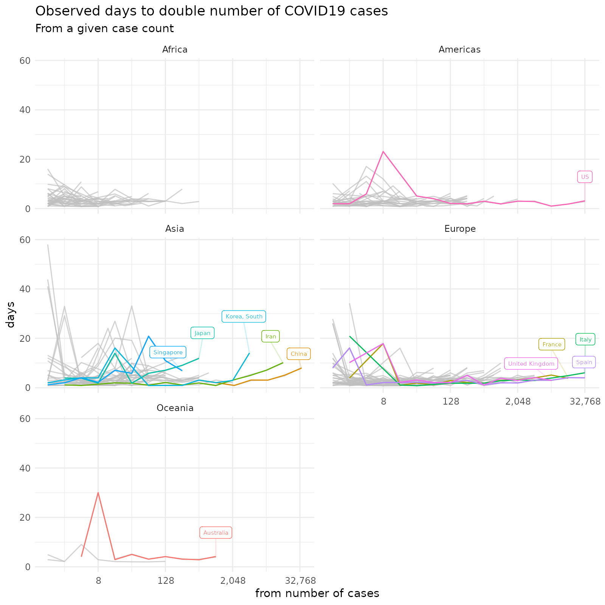

# COVID-19 Modelling

## Case Doubling Rate



## Source Data
The source data for this modeling comes from a git repository which is
initialised as a submodule in `./input/COVID-19`. To update run:

```
git submodule update --remote
```
## Building the plot

With the repo as your R project working dir call:

```r
drake::r_make()
```

## Getting the dependencies

```r
remotes::install_github("milesmcbain/capsule")
capsule::reproduce_lib()
```
